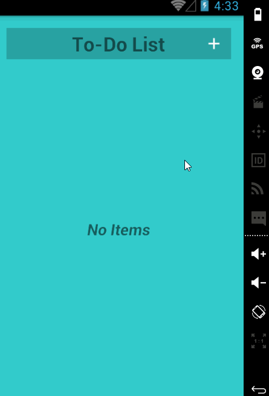

# ToDoList_Project
An small entry demo app to join the CoderSchool.Vn's learning activity. See the Tutorial on our cliffnotes for a step-by-step tutorial.

Time spent: 12 hours implementation in total
Implement link: https://github.com/TienVNguyen/Android/tree/master/CoderSchool_VN/Elementary/ToDoList
App link: https://github.com/TienVNguyen/ToDoList_Project

Completed these requirements:

 * [x] Required: Successfully add and remove items from the todo list
 * [x] Required: Successfully include support for editing todo items
 * [x] Required: Persist todo items and retrieve them properly on app restart
 * [x] Required: Go through the author's details as extra information on app's logo
 * [x] Required: Consistency to go from the begining to the end
 
Notes:

Walkthrough of all functionalities:

